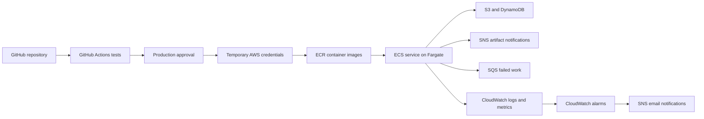

# How we deployed finbot-filings

This explains the first deployment in account `559007813222`, region `us-east-1`.
For commands, exact image digests, verification evidence and current status, use
[DEPLOYMENT.md](DEPLOYMENT.md). This guide explains why each step exists.

## The overall flow

Your laptop prepared and deployed the infrastructure. GitHub then delivered the
application container into that infrastructure. AWS runs the container and stores
its durable state.

The ingestion process also contacts Yahoo for earnings-calendar observations and
the SEC for filings. It is a background worker; this deployment does not create a
public website or HTTP API.

## 1. We established the deployment identity

`aws sts get-caller-identity` confirmed which account and IAM user your CLI would
use. Your `default` profile is the operator identity used to deploy infrastructure.
The separate read-only identity lets Codex inspect resources without changing them.

Your IAM user, the application and GitHub have different jobs and permissions.
Signing in as an administrator did not give the running application administrator
access. Its task role has the narrower permissions defined in the runtime stack.

## 2. We bootstrapped CDK

The `cdk bootstrap` command deployed the `CDKToolkit` CloudFormation stack from
the saved template in `infra/bootstrap/`. This creates shared deployment machinery:
an S3 asset bucket, an ECR asset repository, deployment/publishing/lookup roles,
a CloudFormation execution role and an SSM bootstrap-version parameter.

CDK uses these resources to publish templates and supporting assets before
CloudFormation creates the application resources. The bootstrap bucket is separate
from the application's raw-filing artifact bucket. The bootstrap ECR repository is
also separate from `finbot-prod-ingestion`.

`hnb659fds` is the bootstrap template's default qualifier: a naming component that
CDK expects to match its stack synthesizer. It is not a password or random value
generated for each deployment. Bootstrap version `32` describes the deployment
template protocol, not a finbot application release.

We customized the saved template to use S3-managed encryption and adopted
[ADR 010](adr/010-use-service-managed-encryption-without-kms-integration.md).
Finbot has no KMS integration; SNS messages remain unencrypted at rest by design.
Termination protection was enabled for the bootstrap stack.

## 3. We deployed durable state

The `finbot-prod-state` stack owns resources intended to survive application
releases:

| Resource | Purpose |
| --- | --- |
| S3 artifact bucket | Original downloaded filing bytes |
| Companies table | Reviewed company universe and enabled-company index |
| Calendar table | Earnings expectations and calendar-sync state |
| Filings table | Filing acquisition and recovery checkpoints |
| Artifacts table | Artifact metadata and publication checkpoints |
| Artifact-ready SNS topic | Notification that an artifact is available |
| Failed-work SQS queue | Records of work requiring investigation |
| Application ECR repository | Retained container images identified by digest |

The S3 policy requires conditional creation, so application writes cannot silently
replace an existing object. The application role is explicitly denied object
deletion. DynamoDB checkpoints make interrupted work recoverable.

`cdk diff` showed the intended additions. `cdk deploy` submitted them to
CloudFormation, which created and tracked the actual resources. Stack outputs gave
us the real generated names and ARNs to use in later configuration.

## 4. We built the initial container

Docker packaged Python, dependencies and the installed finbot application into an
image. We built for `linux/arm64` because the runtime task definition selects ARM64.
Container integration tests exercised the built image, rather than only the source
checkout.

We authenticated Docker to ECR, tagged the image with the repository URI and
pushed it. ECR returned a digest: a content identity such as `sha256:...`. A tag is
a readable release label; ECS uses the digest to select the exact image bytes.

The ECR scan reported one HIGH zlib finding. You explicitly accepted that known
finding for this research deployment. We recorded the decision without claiming
the package was fixed or the finding was a false positive.

## 5. We deployed the runtime, initially stopped

The `finbot-prod-runtime` stack creates the network, ECS cluster/service, baseline
task definition, IAM roles, logs, alarms and GitHub federation resources.

A **task definition** is a versioned recipe: image, CPU/memory, platform, environment,
roles, health check and shutdown settings. A **task** is a running instance of that
recipe. An **ECS service** maintains the requested number of tasks. **Fargate** supplies
the compute without us provisioning EC2 hosts.

The runtime uses two public subnets, public task IPs and an outbound HTTPS security
group rule, with no inbound rules or NAT gateway. It can contact the external data
providers through the configured internet route. It exposes no public application
endpoint.

We deployed the service with `desiredCount=0`: infrastructure existed, but no normal
ingestion process was running. This let us finish delivery, input and alarm setup
before contacting live providers from the continuous runtime.

The task's **execution role** lets ECS pull the image and write container logs.
The **task role** gives the application access to its specific data resources.
The **release role** lets GitHub publish application images and update this service.
Those are distinct from the CloudFormation role that creates infrastructure.

## 6. We connected GitHub to AWS

GitHub holds the source and runs CI and delivery. CI checks application behavior,
infrastructure definitions, workflow syntax and container behavior. CI success alone
does not start ingestion.

The GitHub OIDC provider lets AWS verify a short-lived identity token issued to an
approved workflow. The release role trusts the specific repository's `production`
environment subject, including the permanent owner/repository IDs. GitHub exchanges
that token for temporary role credentials; we did not save long-lived AWS access
keys as GitHub secrets.

We saved the GitHub environment and branch-policy inputs under `infra/github/`
and applied them with `gh api`. Production requires your review and allows the
`main` branch. The non-secret deployment variables are also saved as source files.

| Setting | Meaning |
| --- | --- |
| Repository `FINBOT_DELIVERY_ENABLED` | Allows the delivery workflow to run |
| Production `FINBOT_ACTIVATION_APPROVED` | Allows delivery to start or retain an active service |
| Manual input `activate=true` | Requests initial startup of a stopped service |
| Production environment approval | Your approval of this particular workflow run |

These controls serve different purposes. Applying variables does not dispatch a
workflow. Dispatching a workflow does not bypass its environment review. A staged
release with `activate=false` keeps an already stopped service stopped; it is not
a command to stop an already active service.

## 7. We staged and checked the application

The delivery workflow built and tested an image, pushed it to ECR, registered a new
task-definition revision and pointed the stopped service at that revision. It saved
a release manifest containing the source commit, digest, previous/new revision and
observed outcome.

We seeded the 50-company universe through a saved, conditional DynamoDB transaction
and verified its stored identities and enabled index. We also ran the maintained
30-day calendar collection check locally: 49 companies had observations, and you
reviewed the absence for NVDA as expected.

We provisioned the SNS alarm subscription through CDK, confirmed your email
subscription and verified the CloudWatch-to-SNS-to-email path. Alarm notifications
and artifact-ready notifications use separate topics.

The finite Fargate diagnostic ran the exact staged image with a command override.
It checked task-role credentials, company reads, checkpoint writes/reads, conditional
S3 behavior, writable temporary storage, synthetic memory headroom and CloudWatch
metric delivery. It did not start ingestion or call Yahoo/SEC.

The first diagnostic task failed before Python started because Fargate could not
pull the image. Read-only inspection and a local pull confirmed the digest existed.
A retry with a fresh RunTask request token succeeded without image, network or IAM
changes. The original failure's root cause remains undetermined.

The successful check exited zero. We reviewed its isolated test records and deleted
only those fixtures through saved/explicit AWS CLI inputs, then verified absence.

## 8. We requested activation of the checked image

We changed the saved activation setting to `true` and applied it with `gh variable
set`. We then dispatched the workflow with `activate=true` and the exact already
tested digest, avoiding a rebuild between checking the image and activating it.
You approved that production deployment.

The release path registers a new task-definition revision and sets desired count
to one. It waits for the expected healthy task and records a verified release
outcome. Normal startup includes a 150-second quiet period before SEC activity.

After release, we separately inspect actual calendar-sync completion, correct
company scope, freshness, SEC activity and application errors. ECS `HEALTHY` proves
the configured process health check passed; it does not by itself prove calendar
coverage or successful artifact delivery. First-start observations also cannot
establish long-term provider reliability or worst-case memory use.

For this activation, the workflow succeeded, ECS reported one healthy task and the
full cloud calendar sync completed with 47 events across the 50-company scope.
Actual filing storage and publication checkpoints were verified. One Citigroup
submission text exceeded the configured 64-MiB cap and went to failed work while
the service continued. Activation success therefore does not mean every document
has been acquired; the deployment record and backlog preserve that follow-up.

## Future changes

**Application changes:** commit/push, let CI pass, review the production delivery,
and inspect its manifest and runtime evidence. While active, delivery preserves
count one and uses a stop-before-start handoff. This deliberately causes an outage
while the old task stops and the new one starts; the SEC quiet period adds delay.

**Infrastructure changes:** review `cdk diff`, serialize against delivery, preserve
the currently deployed digest in local CDK configuration and follow the manual
infrastructure procedure in DEPLOYMENT.md. CDK deployment deliberately returns the
service to count zero. Update GitHub's baseline variable from the resulting stack
output, then explicitly reactivate after review.

The CloudFormation baseline and GitHub application revision have different owners.
For this activation the baseline remained revision `3`; GitHub registered revision
`5`. Do not change the baseline variable to each GitHub-created application revision.

Infrastructure code, GitHub settings inputs, seed inputs and diagnostic inputs are
saved in the repository. Their existence on disk does not prove they were applied:
the deployment record captures the commands and observed cloud results. Avoid
manual console changes so future diffs and reviews stay understandable.
